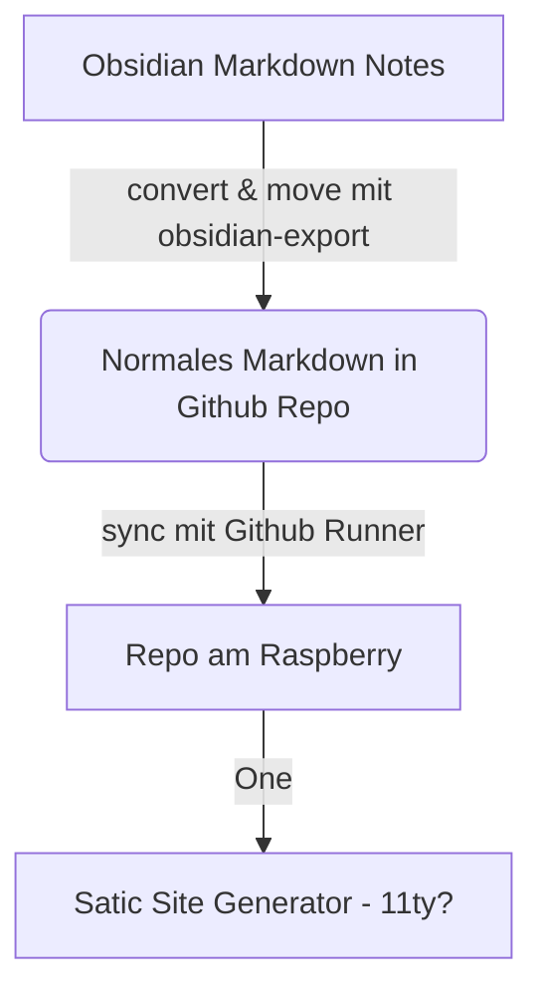

# Kleines Projekt

## 💡**Idee:** Blog hosten am Raspberry Pi

### Aufbau
- Blogbeiträge in Obsidian schreiben
- Mit [obsidian-export](https://github.com/zoni/obsidian-export) oder mit einem der folgenden Forks in normales Markdown verwandeln:
	- https://github.com/jforberg/obsidian-export
	- https://github.com/brandonkboswell/obsidian-export/tree/title_frontmatter ==<- am besten dieser, weil aus dem File Name ein Titel Attribut generieren kann==
- Obsidian Export in ein Git-Repo outputten lassen (besser noch in den Posts/Notes Ordner von einem Template eines SSG)
- Mit Git pushen
- Am Raspberry Pi über Github Actions/Github Runner neu bauen

Weiter zu Starter Template überlegungen [[Welches Starter Template?]]